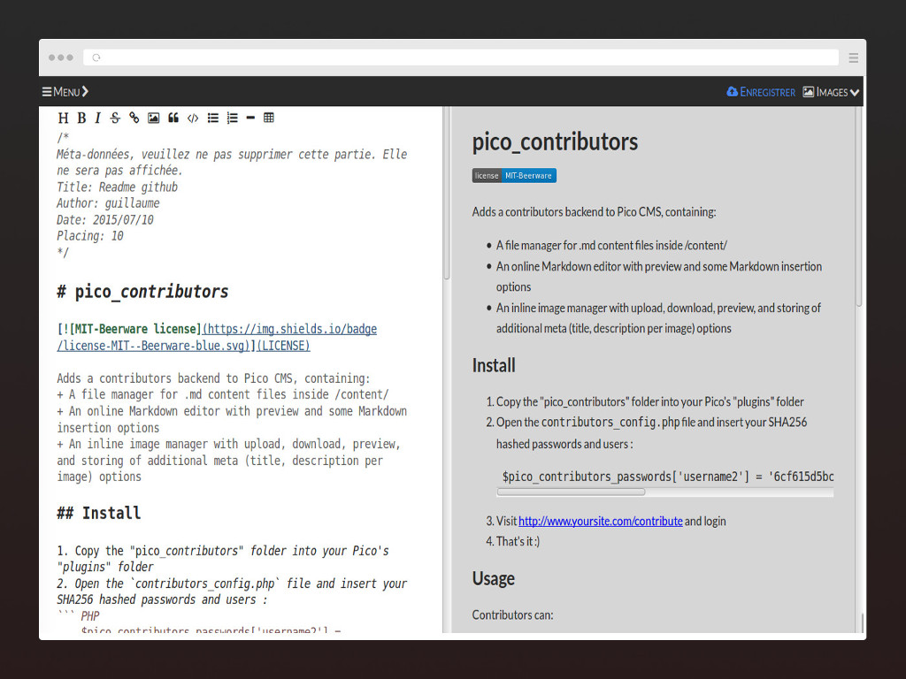

# pico_contributors

[](LICENSE)

Adds a contributors backend to Pico CMS, containing:
+ A file manager for .md content files inside /content/
+ An online Markdown editor with preview and some Markdown insertion options
+ An inline image manager with upload, download, preview, and storing of additional meta (title, description per image) options

## Install

1. Copy the "pico_contributors" folder into your Pico's "plugins" folder
2. Open the `contributors_config.php` file and insert your SHA256 hashed passwords and users :
``` PHP
    $pico_contributors_passwords['username2'] = '6cf615d5bcaac778352a8f1f3360d23f02f34ec182e259897fd6ce485d7870d4';
```
3. Visit http://www.yoursite.com/contribute and login
4. That's it :)

## Usage

Contributors can:
+ create a new page named _timestamp_-_username_.md,
+ view, edit and delete all the pages they've created (all those with their username included in the filename),
+ upload, edit and delete images in their folder /content/images/_username_/

### Screenshots



## Changelog


    1.2.0       Release on GitHub.
    1.1.2       Code comment.
    1.1.1       Locale fr.
    1.1.0       New theme based on the Pico official website theme (HTML5 responsive mobile friendly).
    1.0.1       Ctrl+S save on CodeMirror.
    1.0.0       CodeMirror instead of Markitup.
    0.2.1       Multiple users support.
    0.1.2       Fixing several funny bugs in PicoAdmin
    0.1.1       Refactoring PicoAdmin

## License
Licensed under the terms of the MIT-Beerware license.
See the [LICENSE](LICENSE) file for license rights and limitations.

### Third Party Credits

+ Pico Contributors plugin was initially started by refactoring the **Pico Admin** plugin by Kay Stenschke (http://www.coexec.com/), itself based on the Pico Editor plugin by Gilbert Pellegrom,
+ Greatly inspired by the **Parvula** backend by Fabien Sa (https://github.com/BafS/parvula),
+ Markdown editor: **CodeMirror** (http://codemirror.net/),
+ Preview: **Marked** (https://github.com/chjj/marked),
+ Guided tour: **introJS** (https://usablica.github.io/intro.js/),
+ Icons: **Font Awesome** (https://fortawesome.github.io/Font-Awesome/),
+ Reset CSS: **Normalize.css** (https://necolas.github.io/normalize.css/),
+ Uses **jQuery** (https://jquery.com/).