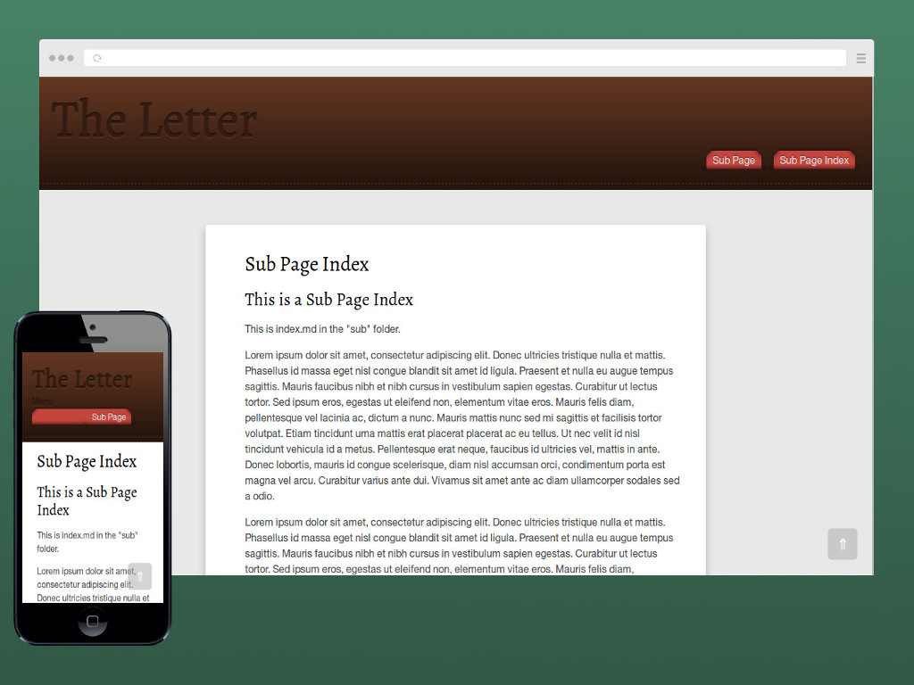

# The Letter
[](LICENSE)

## About
_The Letter_ is a simple responsive blog theme for [Pico](http://picocms.org/). It was made for a fast blog with multiple contributors. The idea behind it is simple: two or more people (the authors) write a bunch of letters to each others.



The name come from the famous song by The Box Tops : [The Letter](https://www.youtube.com/watch?v=BQaUs5J2wdI).

## Installation
Create a folder named _the-letter_ in your Pico theme folder. Then copy the files into that folder. Open the `config.php` file in your root of Pico. Change this line:
``` PHP
$config['theme'] = 'the-letter';
```

## Recommended settings
+ this theme should be used for a **blog**,
+ order your pages **by date**: `$config['pages_order_by'] = 'date';`,
+ order your pages **descending**: `$config['pages_order'] = 'desc';`,
+ customize the `css/style.authors.css` file to distinct each author.

## Support
Chrome, Firefox, Opera, Safari, IE8+.

## License
This theme is free and open source software, distributed under the [MIT-Beerware License](LICENSE). So feel free to modify this theme to suit your needs.

### Third-party credits
+ CSS reset based on **[Normalize.css](https://necolas.github.io/normalize.css/)**,
+ **[HTML5Shiv](https://github.com/afarkas/html5shiv)** and **[Selectivzr](http://selectivizr.com/)** for IE8 support,
+ **[Respond.js](https://github.com/scottjehl/Respond)** for media queries support,
+ Fast vanilla JS smooth scroll: **[SmoothScroll.js](https://github.com/alicelieutier/smoothScroll)**,
+ Print styles based on **[HTML5 Boilerplate](https://html5boilerplate.com)**.